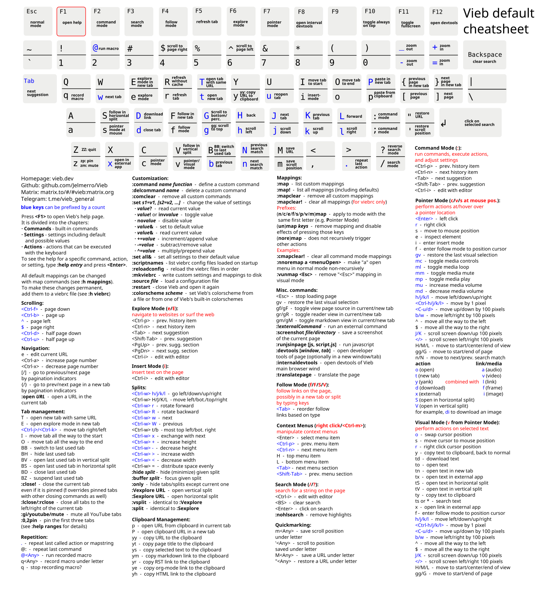

### Vim bindings for the web by design

[](https://vieb.dev)
[](https://github.com/Jelmerro/Vieb/releases)
[](https://github.com/Jelmerro/Vieb/releases/latest)
[](https://github.com/Jelmerro/Vieb/blob/master/LICENSE)
[](https://github.com/sponsors/Jelmerro)
[](https://ko-fi.com/Jelmerro)

[](https://matrix.to/#/#vieb:matrix.org)
[](https://matrix.to/#/#vieb-announcements:matrix.org)
[](https://matrix.to/#/#vieb-general:matrix.org)

[](https://reddit.com/r/vieb)
[](https://t.me/vieb_announcements)
[](https://t.me/vieb_general)

### Vieb is the Vim Inspired Electron Browser

## [Homepage](https://vieb.dev/) - [Download](https://vieb.dev/download) - [Changelog](CHANGELOG.md) - [FAQ](FAQ.md)

*Vieb is pronounced like "deep" with a "v" and rhymes with sheep*

# Features

- __Free__, open source, fast and secure
- __Local first__ adblocking, auto-complete, AMP protection, custom redirects and more, all without web requests
- __Privacy__ with strict permission system, navigator overrides, custom useragent, custom WebRTC policy and more
- __Accessible__ with custom themes, full interface & fontsize scaling, page zooming, spellcheck and mouse support
- __Security settings__ with permissions, cache usage, cookie management, (auto-)download settings and more
- __Window splitting__ with buffer, split, Vexplore and Ctrl-w bindings, for multi-window browsing
- __Map commands__ for completely custom keyboard sequences, keystrokes, commands and actions
- __Viebrc__ config file for all custom/Vim/Vieb commands to configure settings permanently
- __Set command__ for runtime setting configuration exactly like Vim
- __Vim-compatible options__: showcmd, timeout, colorscheme, maxmapdepth, spelllang, splitright, smartcase etc.
- __Container tabs__ with colored grouping, auto-clearing, individual cookies and tab restore from containers
- __Ad-blocker__ with cosmetic filtering, optional updater, custom lists and uses easylist/ublock lists by default
- __Tabs__ including audio indicator, a toggle for multi-line tabs, pinned tabs, muted tabs and suspended tabs
- __Offline help documentation__ always available upon pressing __F1__
- __[And much, much more](https://vieb.dev/features)__

[](https://vieb.dev/screenshots)

#### [More screenshots](https://vieb.dev/screenshots)

## Erwic

With the "erwic" startup option, you can "Easily Run Websites In Containers".
The purpose of this option is similar to programs such as Franz, Ferdi or Rambox.
It can also replace other Electron-based desktop apps such as Slack or Discord.
These instances of Vieb can run separately from your existing Vieb.
See [Erwic.md](Erwic.md) for usage and details.

# Download

There are many ways to download and install Vieb.
Besides running from source or making your own builds,
these are the main sources to download Vieb.
For startup help, see the [frequently asked questions](FAQ.md).

### [Vieb.dev](https://vieb.dev/download)

The official Vieb website, where you can download the latest stable release for many platforms.

### [Github](https://github.com/Jelmerro/Vieb/releases)

The same releases that are offered on [vieb.dev](https://vieb.dev/download),
but with release notes and previous versions listed.

### Fedora

I host a custom DNF repository that you can use for Vieb instead of downloading from [vieb.dev](https://vieb.dev/download) or Github.

```bash
sudo dnf config-manager --add-repo https://jelmerro.nl/fedora/jelmerro.repo
sudo dnf install vieb
```

### Third-party

These releases are made by users just like you for their favorite system.
Third-party releases might be outdated (in red) or customized compared to official builds,
but they are probably the simplest way to get started if your system is listed.

[](https://repology.org/project/vieb/versions)

# Cheatsheet

Quickly get an overview of the default mappings and basic usage.

[](https://vieb.dev/cheatsheet)

# Contribute

You can help by reporting issues and suggesting new features on the [Github issue tracker](https://github.com/Jelmerro/Vieb/issues).
Another way to help is by supporting Jelmerro on [ko-fi](https://ko-fi.com/Jelmerro) or [github](https://github.com/sponsors/Jelmerro).
Donating is completely optional because Vieb will always be free and open source.
If you know how to write Electron applications, you can also help by writing code.
Check the ['help wanted' issues](https://github.com/Jelmerro/Vieb/issues?q=is%3Aissue+is%3Aopen+label%3A"help+wanted") for suggestions on what to work on.
Please try to follow these guidelines while working on Vieb:

- Use Vim to edit :)
- Follow the included eslint style guide
- Use editorconfig for indentation

For an example vimrc that is configured to use these tools, you can check out my personal [vimrc](https://github.com/Jelmerro/vimrc).

# Building

To create your own builds or run Vieb from source, you need to install [Node.js](https://nodejs.org).
The next step is to clone the repository or download the source code.
After downloading, make sure you are in the cloned/extracted Vieb folder and run:

```bash
npm ci
npm start
```

If this runs Vieb as expected, you can generate builds for your platform with `node build`.
To see the full list of run and build options, simply execute `node build --help`.
The base configuration for what to build is stored in the `electron-builder.yml` config file,
in combination with the `build.js` script and the `webpack.config.js`.
The `build.js` script is the starting point for creating custom builds,
you can easily extend the `releases` object in this script with new configurations.

# License

Vieb is created by [Jelmer van Arnhem](https://github.com/Jelmerro) and [contributors](https://github.com/Jelmerro/Vieb/graphs/contributors).
See the source files for individual authors.

You can copy or modify the code/program under the terms of the GPL3.0 or later versions.
For more information and legal terms, see the LICENSE file.
